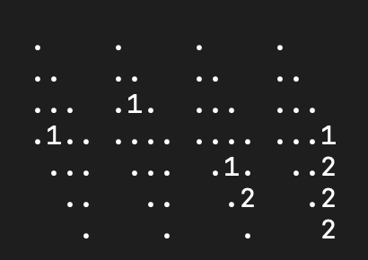
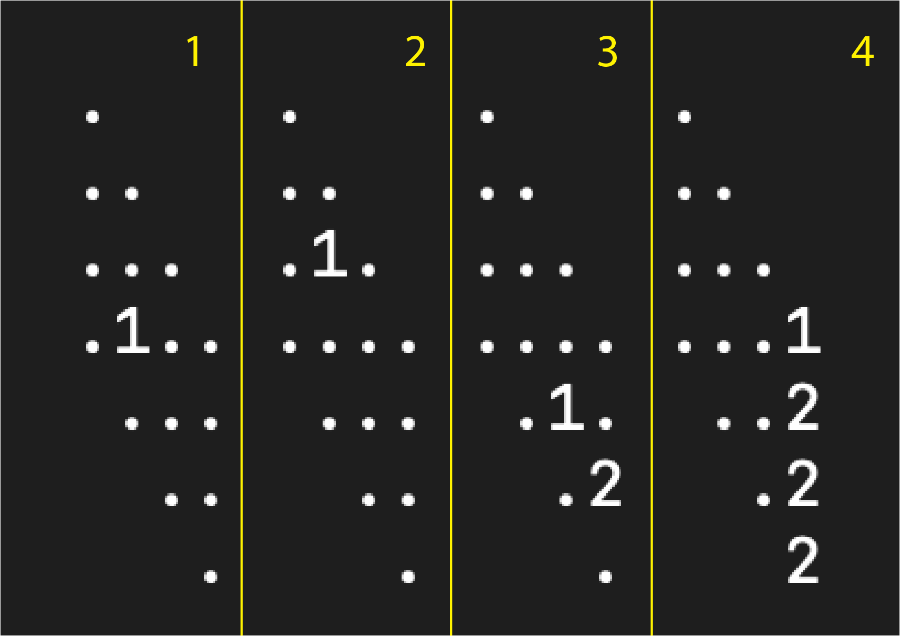
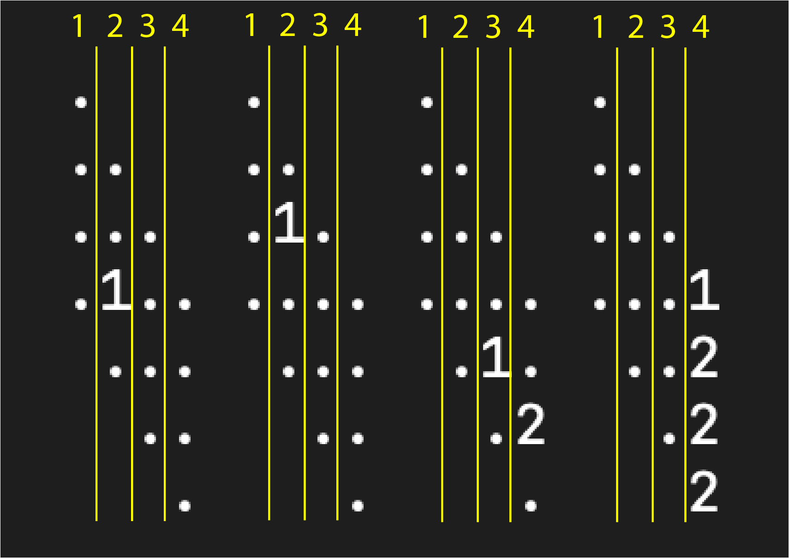
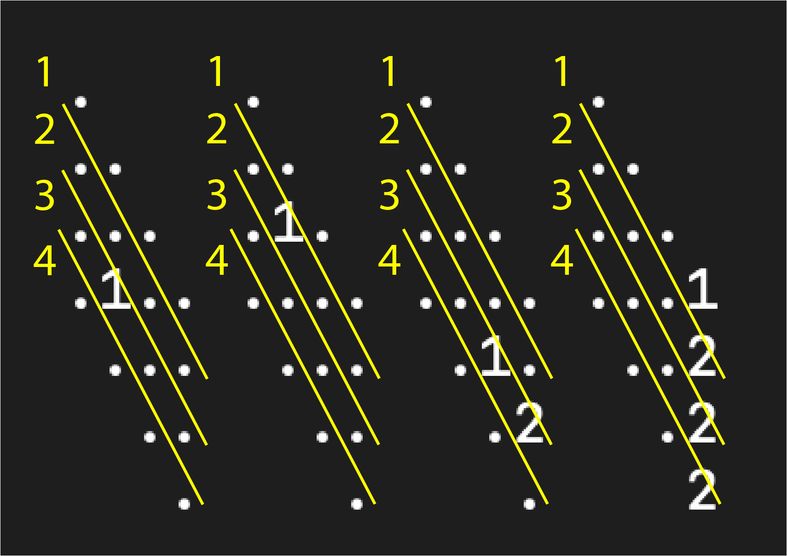

# Qubic Tic Tac Toe


This is a game of tic tac toe, but you have to get four in a row, and it's in 3D. Connecting four in a row can be done horizontally on or through a planes, vertically on or through a planes, or diagonally on or through planes, or some combination. Visually it can be difficult to see, but writing out the coordinates can be helpful.

## How to execute
This must be run on a computer that has JAVA installed. I included a makefile so on some systems in the terminal one can simply type `make run`. Otherwise run

```bash
javac *.java
java QubicBoard
```


## How to play
Enter three numbers, coordinates to your next move. The first specifies what plane, or slice, you want your mark placed.



The next number is what column you want your mark placed in.



The next number is how deep you want your mark placed, or on what diagonal



## Win examples

1,1,3 -
1,2,3 -
1,3,3 -
1,4,3 

1,4,1 -
2,3,2 -
3,2,3 -
4,1,4 

3,2,1 -
3,2,2 -
3,2,3 -
3,2,4 